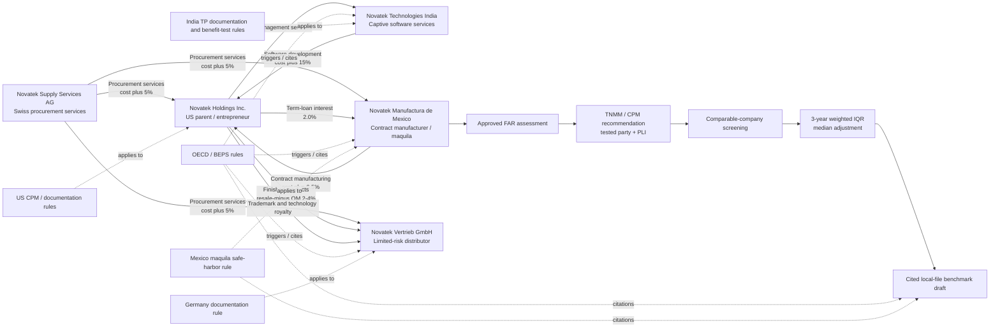

# Neo4j Transfer-Pricing Graph

This is the demo graph for the Novatek group. It turns the mock transaction export, functional profiles, compliance rules, financials, and comparable sets into a traceable analysis graph.

## Graph semantics

- `LegalEntity` nodes represent group companies with jurisdiction, functional profile, assets, risks, and tested-party attributes.
- `INTERCOMPANY_TRANSACTION` relationships represent the recorded flow between legal entities and retain transaction facts on the relationship.
- `TPRule` nodes are linked to entities and transactions when their conditions apply; every rule carries a source citation and illustrative-data flag.
- `FinancialResult`, `Comparable`, `FARAssessment`, `Benchmark`, `Citation`, and `AuditEvent` nodes support the reviewable TNMM workflow described in the PRD.
- A conclusion must be traceable from the benchmark back to selected comparables, approved FAR facts, intercompany transactions, and regulation rules.
